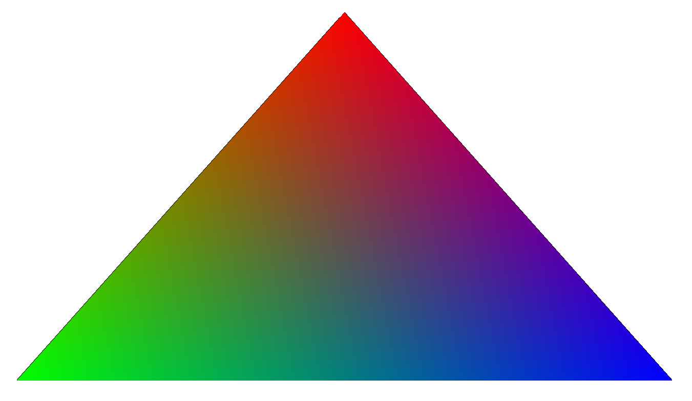
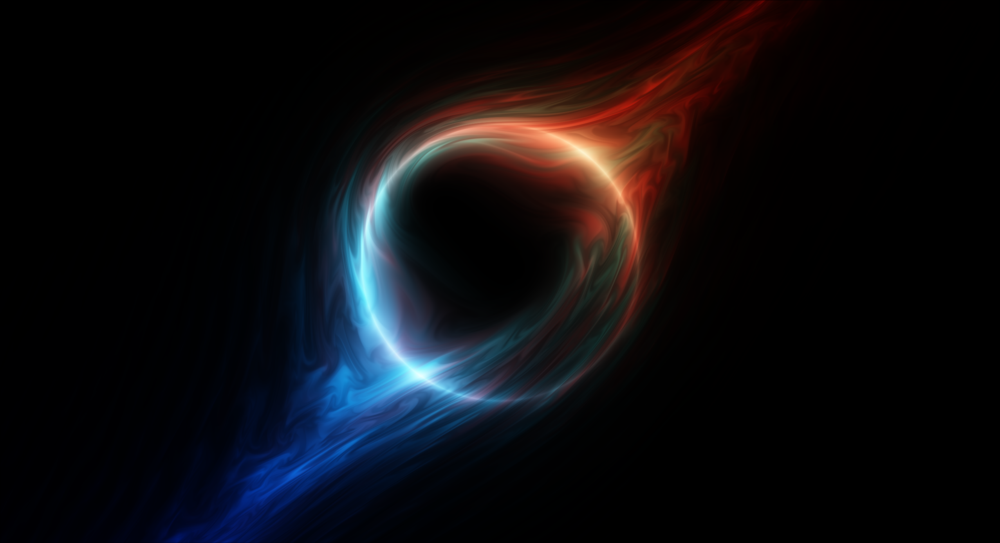
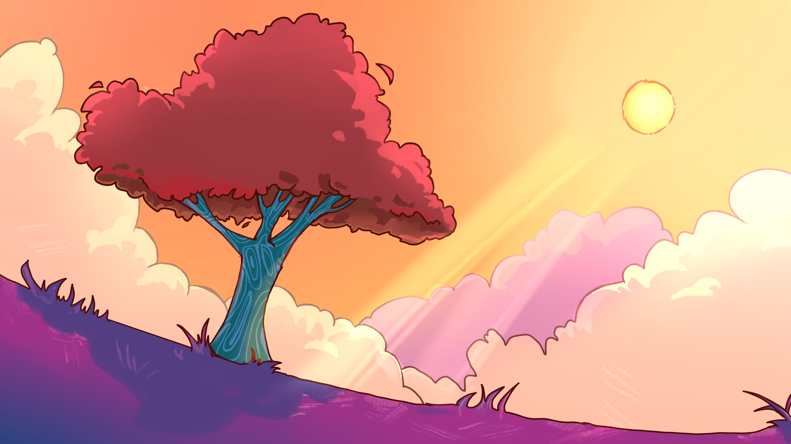
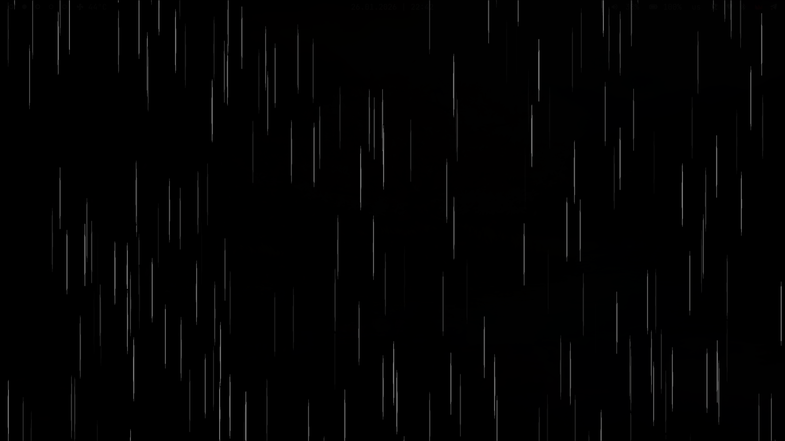
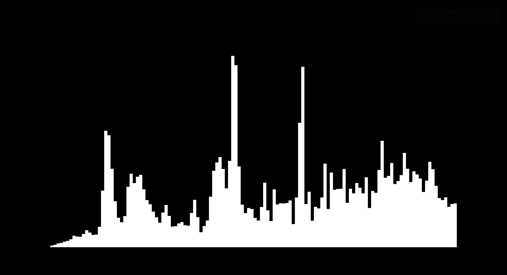

\page examples Examples

Repository contains some small scenes that demonstrate OpenWallpaper API usage.

## Building examples

To build examples yourself, you will need to install:

- WASM C compiler, [wasi-sdk](https://github.com/WebAssembly/wasi-sdk/releases) recommended
- glslc
- zip

Clone the repository:

```sh
git clone --depth=1 --recurse-submodules https://github.com/mechakotik/openwallpaper
cd openwallpaper
```

Set `WASM_CC` environment variable to your WASM C compiler path. If you have installed wasi-sdk to `/opt/wasi-sdk`, then the compiler is located in `/opt/wasi-sdk/bin/clang`.

```sh
export WASM_CC=/opt/wasi-sdk/bin/clang
```

Then you can build examples with shell scripts:

```sh
./examples/triangle/compile.sh
./examples/fullscreen-shader/compile.sh
./examples/visualizer/compile.sh
```

Resulting `.owf` files will be in corresponding example directories.

## triangle

Draws a triangle in the center of the screen, classic example of graphics API usage. You can see an explanation of how this code works in [Drawing a triangle](\ref triangle) developer guide section.

<div style="text-align:left;">
    
</div>

[Download owf](triangle.owf)

[Source code](https://github.com/mechakotik/openwallpaper/tree/main/examples/triangle)

## fullscreen-shader

Demonstrates how to run shader wallpapers (e.g. from ShaderToy) in OpenWallpaper. Shader that was ported is [Singularity by @XorDev](https://www.shadertoy.com/view/3csSWB).

<div style="text-align:left;">
    
</div>

[Download owf](fullscreen-shader.owf)

[Source code](https://github.com/mechakotik/openwallpaper/tree/main/examples/fullscreen-shader)

## image

Draws a static image, simplest example of texture rendering. Original image is Scarlett Tree from KDE Plasma 6 artwork.

<div style="text-align:left;">
    
</div>

[Download owf](image.owf)

[Source code](https://github.com/mechakotik/openwallpaper/tree/main/examples/image)

## rain

Draws particles to create a rain-like effect. An example of using instanced rendering to draw a lot of similar objects efficiently.

<div style="text-align:left;">
    
</div>

[Download owf](rain.owf)

[Source code](https://github.com/mechakotik/openwallpaper/tree/main/examples/rain)

## visualizer

Example of using `ow_get_audio_spectrum` to visualize audio. It gets spectrum data and draws it as white bars on the screen, without any preprocessing.

<div style="text-align:left;">
    
</div>

[Download owf](visualizer.owf)

[Source code](https://github.com/mechakotik/openwallpaper/tree/main/examples/visualizer)

